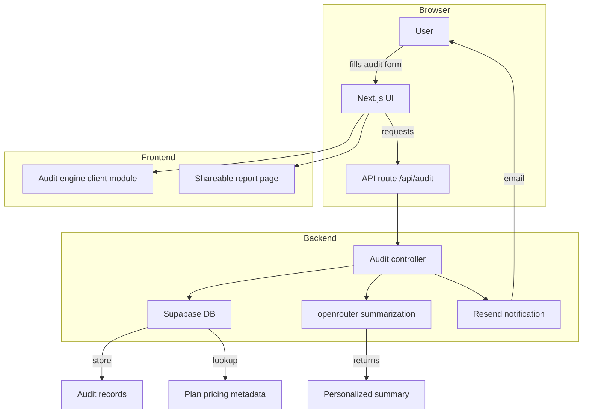

# Eudora Architecture

## System architecture

## Full data flow

1. User enters AI subscriptions, current plans, and monthly spending.
2. The frontend validates inputs and executes baseline calculations via the audit engine.
3. The form submits to `/api/audit`.
4. Backend validates rules again, stores the audit in Supabase, and triggers `openrouter` to generate a summary.
5. The backend returns audit details and a share URL.
6. The UI renders monthly/yearly savings and shows the generated summary.
7. If the user opts in, backend sends a lead notification or email with Resend.

## Frontend/backend separation

- **Frontend**: React pages, audit form, results visualization, shareable report rendering, client-side validation.
- **Backend**: Audit persistence, business rule enforcement, AI summary orchestration, lead capture.
- Shared logic: TypeScript types and audit engine helpers are shared between frontend and backend to avoid mismatched savings calculations.

## Audit engine architecture

- Core module lives in `frontend/audit-engine`.
- Input transformer takes subscription data and normalizes vendor-specific fields.
- Rules engine applies deterministic financial calculations:
  - overprovisioned seats
  - plan mismatch
  - unused premium features
  - annual vs monthly price gaps
- Output layer exports `monthlySavings`, `annualSavings`, `recommendedPlan`, and `confidenceNotes`.

## Database structure

- `audits`
  - `id`
  - `created_at`
  - `company_name`
  - `email`
  - `audit_input`
  - `audit_output`
  - `monthly_savings`
  - `annual_savings`
  - `summary_text`
  - `share_slug`

- `pricing_metadata`
  - `vendor`
  - `plan_name`
  - `monthly_price`
  - `annual_price`
  - `seat_range`
  - `notes`

- `lead_events`
  - `id`
  - `audit_id`
  - `created_at`
  - `email`
  - `marketing_source`

## API flow

- `POST /api/audit`
  - validate input
  - calculate savings using shared engine
  - persist audit snapshot
  - call openrouter for summary
  - return audit result and shareable link

- `GET /api/audit/[slug]`
  - resolve share slug
  - retrieve persisted audit
  - render public report without exposing raw customer metadata

- `POST /api/lead`
  - capture lead details after summary view
  - send confirmation email via Resend

## Why Next.js was chosen

- Unified frontend and serverless API surface reduces deployment complexity.
- Built-in page routing, static rendering, and incremental adoption of server components.
- Good fit for a product that needs fast multi-page onboarding, results pages, and a small backend API.

## Why TypeScript was chosen

- Prevents hidden mismatches in financial calculations.
- Improves developer confidence across shared frontend/backend logic.
- Makes future API contract changes easier to reason about.

## Scalability plan for handling 10k audits/day

- Cache pricing metadata in-memory for audit requests.
- Use Supabase connection pooling and read replicas for audit lookups.
- Keep audit engine stateless, so we can horizontally scale backend service.
- Use queueing for non-critical jobs like follow-up email sending and summary refresh.
- Add rate limits on public share endpoints to avoid abuse.

## Security considerations

- Validate audit payloads server-side before persistence.
- Use Supabase Row Level Security for audit ownership if authenticated users are added.
- Sanitize and limit AI prompt input to avoid prompt injection via user text.
- Protect API keys in environment variables only.
- Use HTTPS everywhere and require secure cookies in production.

## Performance considerations

- Compute core audit rules in memory with O(n) vendor analysis.
- Avoid repeated LLM calls by caching summaries for identical audit payloads for a short window.
- Use edge-friendly cached result pages for shareable audit reports.
- Defer email sends with background jobs to keep API response times under 300ms.
